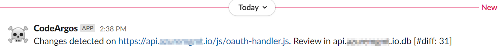

# CodeArgos
[](https://sonarcloud.io/dashboard?id=codeargos-github)
[](https://sonarcloud.io/dashboard?id=codeargos-github)
[](https://sonarcloud.io/dashboard?id=codeargos-github)
[](https://sonarcloud.io/dashboard?id=codeargos-github)

[](https://sonarcloud.io/dashboard?id=codeargos-github)
[](https://sonarcloud.io/dashboard?id=codeargos-github)
[](https://sonarcloud.io/dashboard?id=codeargos-github)

This tool supports the continious recon of scripts and script blocks in an active web application. 

It populates and maintains an internal database by web crawling a target and detects Javascript files and HTML script blocks, watching for changes as they are published. 

The tool can then produce change diffs between scansets to allow security researchers to pinpoint the changing attack surface of the target web application.
## Install
Install using:
```bash 
git clone https://github.com/DanaEpp/CodeArgos.git 
cd CodeArgos
python3 setup.py install 
```
Dependencies will be installed and `codeargos` will be added to your path.

To create a cron job that will run CodeArgos every day:
```bash
crontab -e
```
Then create an entry that looks something like this:

```bash
@daily python3 -m /path/to/codeargos -u https://yourtarget.com
```

This will run CodeArgos once a day, at midnight against your target web app. You can adjust the schedule to meet your needs, and add additional arguments as needed (defined below).

**NOTE:** If you are using CodeArgos against several different targets, try to schedule recon scan windows at least 30 minutes apart. This will allow CodeArgos to maximize your CPU, threads and bandwidth during the web crawling of each target.

## Usage
When used for RECON:
```bash 
python3 -m codeargos -u target.com 
        [-t thread_cnt] [-d] [-s] [-f /path/to/your/file.db] 
        [-w generic|slack|teams|discord --wurl https://hook.slack.com/some/webhook]
        [-p id|diff|both|none]
        [--scope /path/to/scope/file]
```

When used to REVIEW a diff after detection during RECON:
```bash 
python3 -m codeargos -f /path/to/your/file.db --diff id_num
```

* `-u`, `--url` : The target base URL (with crawl anything it finds underneith it)
* `-t`, `--threads` [optional] : The number of threads to run. By default it is calculated at 5 times your total CPU count
* `-d`, `--debug` [optional] : Write out debug information to local log file (codeargos.log)
* `--stats` [optional] : Dump stats to stdout to show progress of crawl
* `-f`, `--file` [optional] : Reads and stores data across runs using a sqlite database you point to. If not used, default is `target.com.db`, where **target** is the hostname of the URL passed in.
* `-w`, `--webhook` [optional] : Enables notifications to a webhook. Possible options are *slack*, *teams*, *discord* and *generic*. Requires the `--wurl` param. Use generic when sending to Zapier, IFTTT, Microsoft Logic Apps or Microsoft Flow
* `--wurl` or `--webhookurl` [optional] : The fully qualified path to your webhook endpoint. You need to generate this in your favorite web app (Slack/Teams/Discord etc).
* `--diff` : The diff id sent to you by the webhook notification service. Also requires the `-f` option to know which db to read the diff from.
* `-p` or `--print` [optional] : Determines how results are displayed. Options include:
  *  **id** : Shows a list of diff ids
  *  **diff** : Shows the actual diffs between scans
  *  **both** : Shows both the diffs and then the list of ids (default)
  *  **none** : Useful in first time run or when you expect to use notifications to send results
*  `-s` or `--scope` [optional] : Defines the file that will be used for a fixed scope scan. In this mode the crawler will **NOT** add links it discovers to the queue for deeper scanning. It will ONLY scan the files defined. It will also remove whatever target you added in the `-u` param from the queue. You still need to pass `-u` though, as its the seed used to define the database filename unless you pass in `-f`.

## Webhooks support
To assist in notifying your red team of recent code changes, or to get ahead of other bug bounty hunters who may be competing on the same target, consider using webhook notifications. Here is a real life example that got me a $1,000 bounty because I was able to 'get there first'.

> 

Here is another example in Microsoft Teams. Note the "View Code" button launches a browser directly to the affected page:

> 

Finally, here is an example of message being sent to Discord.

> 

For more information on setting up webhook notifications for your favorite apps please see:
* **Slack** : [Detailed instructions](https://api.slack.com/messaging/webhooks). To setup your first one [go here](https://my.slack.com/services/new/incoming-webhook/).
* **Microsoft Teams** : [Detailed instructions](https://docs.microsoft.com/en-us/microsoftteams/platform/webhooks-and-connectors/how-to/add-incoming-webhook)
* **Discord** : [Detailed instructions](https://support.discord.com/hc/en-us/articles/228383668-Intro-to-Webhooks)

### Working with generic webhooks like Microsoft Logic Apps
If you are wanting to get notifications to a different device or email, consider using the "generic" webhook option and configure it to point to a [Microsoft Logic App](https://azure.microsoft.com/en-us/services/logic-apps/). When defining the HTTP receive endpoint in Azure use the following Request Body JSON Schema:

```
{
    "properties": {
        "code_url": {
            "type": "string"
        },
        "content": {
            "type": "string"
        },
        "username": {
            "type": "string"
        }
    },
    "type": "object"
}
```

By defining it in that way, the Logic App will parse out the payload and allow direct dynamic content variables for use in your workflow. From there you can do anything with the payload, from sending it via SMS to your phone or directly to email.

Here is a sample workflow that will send it to a Google Gmail account:


Have fun with it. Generic webhooks and Logic Apps can do some pretty powerful things.

## Tips
If you are having any difficulties in crawling your target web app, consider dialing back the threads used. By default it will select five times the number of CPUs you have. I've found the most success with `-t 10` on targets behind difficult WAFs and load balancers. While there is an incrimental backoff retry pattern in the tool, the reality is CodeArgos can be aggressive on its initial scan as it populates it's database. 

If you aren't sure whats going on, use the `-d` argument and look through the `codeargos.log` file to see what is going on. ie: `tail -f codeargos.log` 

If you find the tool is tripping up on a target, please open an [issue](https://github.com/DanaEpp/CodeArgos/issues) and include your target URL and any log data you are comfortable in sharing. I'll try to take a look at it ASAP.

Don't want to crawl the whole site and only look at one or two Javascript files? No problem. Try something like:
```bash
python -m codeargos -u http://yourtarget.com --scope /path/to/scoped-targets.txt
```

## Dev Tips
You can evaluate the scanner and parser by jumping into the test_site dir and running the launcher. It will load a test web server on port 9000 for you.

```
cd test_site
./launch_test_site.sh
```
In another shell window execute:
```
python3 -m codeargos -u http://localhost:9000 -d -t 10 -f test.db
```
The test site will continue to be expanded on as we find in-field issues with the parsing and data management. If you wish to contribute, here would be a great place to add complex and weird script blocks that we can evaluate and make sure get parsed correctly.

